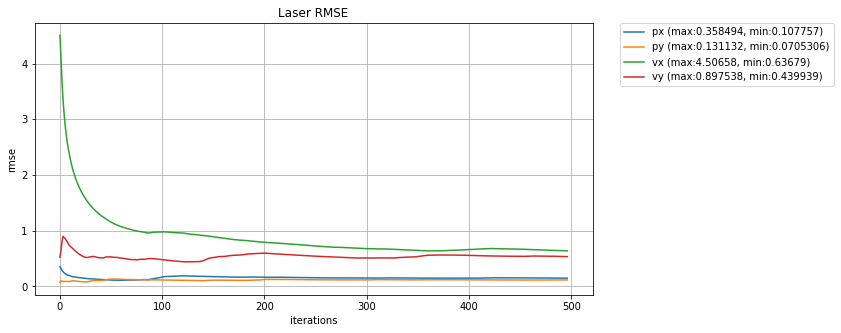
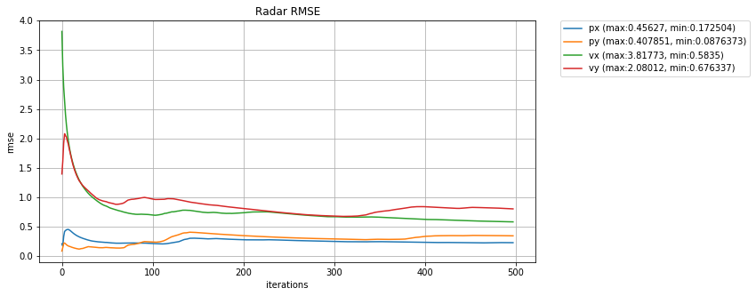
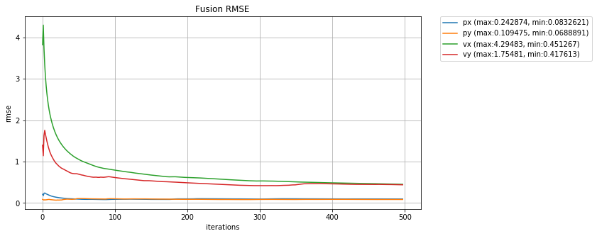

# Extended Kalman Filters

### This project pass through these steps:

* Receives the first measurement and initializes the state, both for **LIDAR** and for **RADAR**
* Receive the next measurement, perform a prediction and then an update based on the measurement received, repeating this cycle continuously.

### Rubric points

#### 1. RMSE <= [.11, .11, 0.52, 0.52]

Here are some graphs showing the behavior of the RMSE in each situation







#### 2. Kalman Filter algorithm handles the first measurements appropriately


For initialization using LIDAR as the first measurement, we just need to assign px and p and p to x (state), because the LIDAR measurement is received in Cartesian coordinates. However when we receive a measurement of the RADAR sensor, we need to convert from polar coordinates to Cartesian

**LIDAR**

```c++
else if (measurement_pack.sensor_type_ == MeasurementPackage::LASER) {
  // Initialize state.
  ekf_.x_ << measurement_pack.raw_measurements_[0], measurement_pack.raw_measurements_[1], 0, 0;      
}
```

**RADAR**

```c++
if (measurement_pack.sensor_type_ == MeasurementPackage::RADAR) {
  float rho = measurement_pack.raw_measurements_[0];
  float phi = measurement_pack.raw_measurements_[1];
  // Convert radar from polar to cartesian coordinates and initialize state.
  float px = rho * cos(phi);
  float py = rho * sin(phi);

  ekf_.x_ << px, py, 0, 0;
}
```

#### 3. Kalman Filter algorithm first predicts then updates.

After the state is initialized, we first call the `KalmanFilter::Predict` method and then `KalmanFilter::Update` or `KalmanFilter::UpdateEKF`.

Radar uses non-linear equations, so the update step involves linearizing the equations with the Jacobian matrix

```c++
MatrixXd Tools::CalculateJacobian(const VectorXd& x_state) {
	float px = x_state[0];
  float py = x_state[1];
  float vx = x_state[2];
  float vy = x_state[3];

  //pass the state to the Jacobian Matrix
  MatrixXd Hj = MatrixXd(3, 4);
  
  //pre-compute a set of terms to avoid repeated calculation
  float c1 = px*px+py*py;
  float c2 = sqrt(c1);
  float c3 = (c1*c2);

  //check division by zero
  if(fabs(c1) < 0.0001) {
    cout << " continue division by zero " << endl;
    return Hj;
  }

  //Hj is the function that predict the state into measurement space
  //compute the Jacobian matrix
  Hj << (px/c2), (py/c2), 0, 0,
      -(py/c1), (px/c1), 0, 0,
      py*(vx*py - vy*px)/c3, px*(px*vy - py*vx)/c3, px/c2, py/c2;

	return Hj;
}
```


#### 4. Kalman Filter can handle radar and lidar measurements

The graphs plotted above show that for both sensors the system works correctly, as well as using the fusion method.

#### 5. Algorithm should avoid unnecessary calculations.

To avoid unnecessary calculations, the values were accumulated in variables and reused. Although more reuse is possible, this was not done to not sacrifice the legibility of the code.

### Notes

Para gerar os gráficos de RMSE, foi criado um projeto em python. O código está em [plots.ipynb](https://github.com/matheuslrsouza/CarND-Extended-Kalman-Filter-Project/tree/master/plots/plots.ipynb)